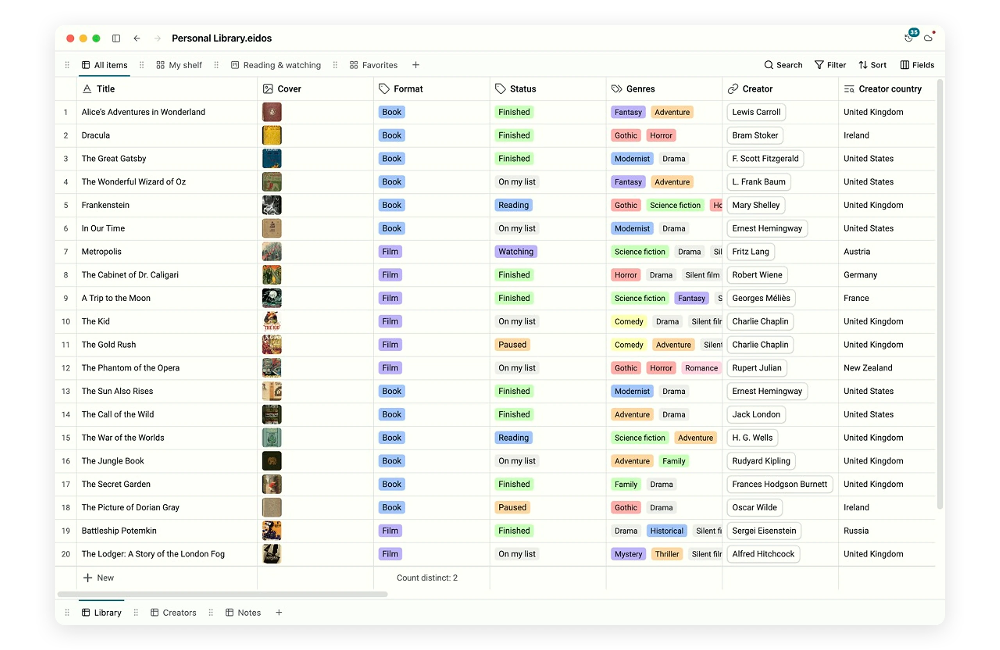
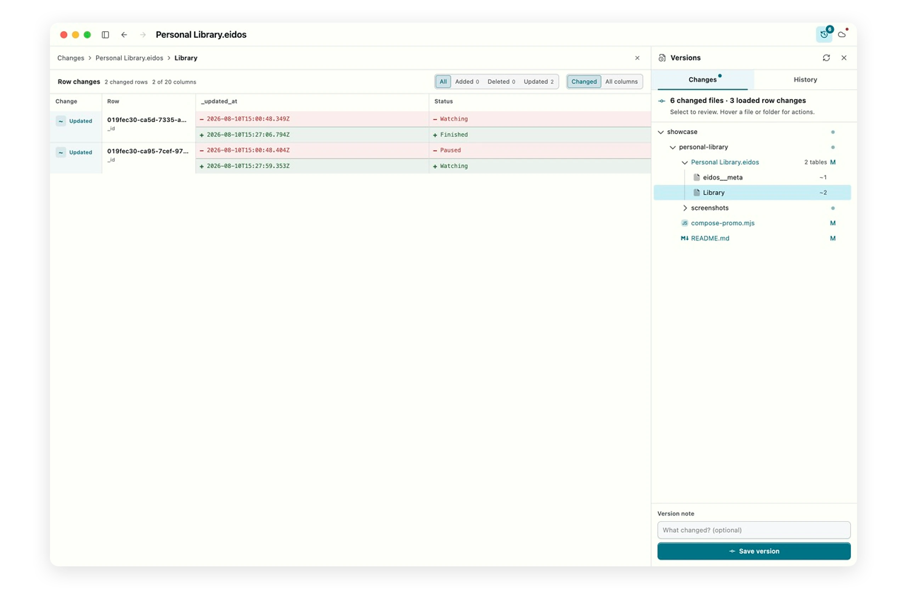
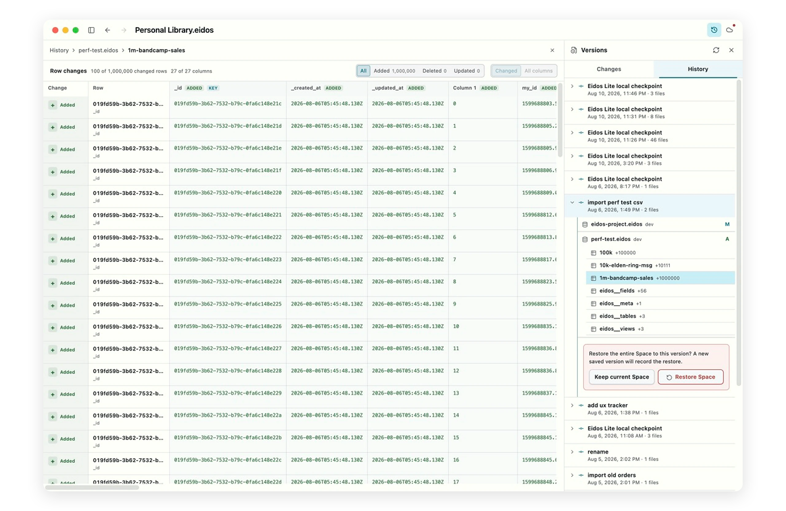

<div align="center">
  <h1 align="center">
    <picture>
      <source media="(prefers-color-scheme: dark)" srcset="static/assets/images/eidos-logo-horizontal-dark.webp">
      
    </picture>
  </h1>
  <h3>An open format. Local-first. A file-based spreadsheet.</h3>
  <p>
    Eidos Lite turns an ordinary folder into a fast, versioned workspace<br />
    powered by open SQLite-based <code>.eidos</code> files.
  </p>
  <p>
    <a href="./apps/eidos-lite-desktop"></a>
    <a href="https://docs.eidos.space/"></a>
    <a href="https://discord.gg/cGQqjeFpZq"></a>
    <a href="https://github.com/mayneyao/eidos/blob/dev/LICENSE"></a>
  </p>
  <p>
    <a href="./README.md">English</a> · <a href="./README.zh.md">中文</a>
  </p>
</div>

## Eidos Lite in practice

<p align="center">
  
</p>

<p align="center"><em>A local Eidos File with typed fields, relations, formulas, and reusable Grid, Gallery, and Kanban views.</em></p>

## Quick start

### Install Eidos Lite

Download Eidos Lite from the [Eidos download
page](https://eidos.space/download#eidos-lite). Local Spaces, editing, and
version history need no account. Sync remains an invite-only private preview
and is unavailable until waitlist access is approved.

### Use the browser

Open [editor.eidos.space](https://editor.eidos.space/) to create or edit a
local `.eidos` file without installing anything.

### Install the CLI

On macOS or Linux:

```bash
curl -fsSL https://download.eidos.space/cli/install.sh | sh
```

On Windows PowerShell:

```powershell
irm https://download.eidos.space/cli/install.ps1 | iex
```

Create a file, then open the same editor UI locally:

```bash
eidos create example.eidos \
  --table Tasks \
  --label-field Title \
  --fields '[{"name":"Title","type":"text"},{"name":"Status","type":"select"}]'
eidos serve example.eidos --open
```

See the [Eidos CLI guide](./apps/cli/README.md) for querying, automation, and
safe mutation workflows.

## Current product line

This repository contains the active Eidos File and Eidos Lite product line,
plus the standalone read-only SQLite Web Viewer. The retired application is
archived on the `legacy/0.32` branch and is not part of current builds, tests,
or releases.

| Product                 | Purpose                                                                | Location                                                                                              |
| ----------------------- | ---------------------------------------------------------------------- | ----------------------------------------------------------------------------------------------------- |
| **Eidos Lite**          | Desktop Spaces, local files, version history, and private-preview Sync | [`apps/eidos-lite-desktop`](./apps/eidos-lite-desktop)                                                |
| **Eidos File Web**      | Open and edit one `.eidos` file in a browser                           | [`apps/eidos-file-web`](./apps/eidos-file-web) · [editor.eidos.space](https://editor.eidos.space/)    |
| **Eidos CLI**           | Create, inspect, automate, and serve `.eidos` files                    | [`apps/cli`](./apps/cli)                                                                              |
| **Eidos File packages** | Portable Runtime and shared React UI                                   | [`packages/eidos-file`](./packages/eidos-file) · [`packages/eidos-file-ui`](./packages/eidos-file-ui) |
| **SQLite Web Viewer**   | Inspect SQLite-compatible files without editing them                   | [`apps/sqlite-web-viewer`](./apps/sqlite-web-viewer)                                                  |

## Eidos Lite

A Space is an ordinary folder the user owns. It can contain multiple `.eidos`
files plus normal text or media files. Eidos Lite adds focused editing,
version history, and invite-only Sync without turning the folder into a
proprietary container.

- `.eidos` files remain standard SQLite databases.
- Eidos File Web, Lite, and `eidos serve` share the same UI package and theme
  contract.
- Graft provides local history. Eidos Sync remains an invite-only private
  preview; joining the waitlist does not grant access automatically.
- Local files remain usable while offline or signed out.

### Local history you can audit

Graft keeps version evidence beside the Space. Eidos Lite can review changed
files and inspect row-level before/after values before saving a named version.

<p align="center">
  
</p>

### Inspect and restore any saved version

Expand a checkpoint into files, tables, changed-row counts, and concrete
row-level details—even for the real million-row import shown below. Restore the
entire Space when needed; the restore creates a new version instead of
rewriting history.

<p align="center">
  
</p>

## Development

Requirements: Node.js `22.23.1` (pinned in [`.node-version`](./.node-version)),
Corepack, and Rust stable for CLI work.

```bash
corepack enable
pnpm install --frozen-lockfile

# Primary desktop app
pnpm dev:eidos-lite
pnpm build:eidos-lite:dev
pnpm test:eidos-lite

# Browser editor
pnpm dev:eidos-file-web
pnpm build:eidos-file-web

# Read-only SQLite viewer
pnpm dev:sqlite-web-viewer
pnpm test:sqlite-web-viewer

# CLI
cd apps/cli
cargo test --workspace --locked
cargo run -- create example.eidos \
  --table Tasks \
  --label-field Title \
  --fields '[{"name":"Title","type":"text"},{"name":"Status","type":"select"}]'
cargo run -- serve example.eidos --open
```

The normative Eidos File contracts live in [`docs/specs`](./docs/specs). See
the [Eidos Lite guide](./apps/eidos-lite-desktop/README.md) for its process
model, packaging gates, and Sync architecture.

## License

The repository is licensed under AGPL v3. The reusable
[`@eidos.space/eidos-file`](./packages/eidos-file) and
[`@eidos.space/eidos-file-ui`](./packages/eidos-file-ui) packages are released
under MIT.
