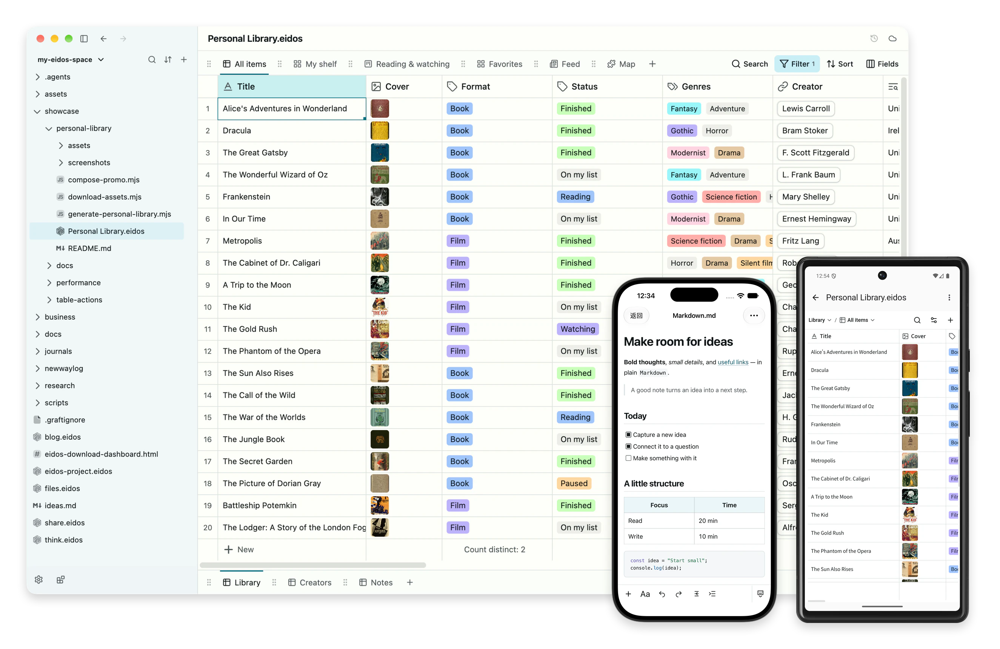

<div align="center">
  <h1 align="center">
    <picture>
      <source media="(prefers-color-scheme: dark)" srcset="static/assets/images/eidos-logo-horizontal-dark.webp">
      
    </picture>
  </h1>
  <h3>A single-file relational spreadsheet, for you and your agent.</h3>
  <p>
    Eidos File is an open, single-file format built on standard SQLite.<br />
    Eidos Lite is the desktop app for working with Eidos Files and ordinary files in a local folder.<br />
    Experimental Android and iOS apps bring local Eidos Files and Markdown editing to your phone.
  </p>
  <p>
    <a href="https://eidos.space/download#eidos-lite"></a>
    <a href="https://docs.eidos.space/"></a>
    <a href="https://discord.gg/cGQqjeFpZq"></a>
    <a href="./LICENSE"></a>
  </p>
  <p>
    <a href="./README.md">English</a> · <a href="./README.zh.md">中文</a>
  </p>
</div>

<p align="center">
  
</p>

## On your phone

Browse local files, edit Markdown, and work with Eidos File tables and records on
Android and iOS. Files and bundled editors remain usable offline without an
account. Pair with Eidos Lite to sync a local Space over the same LAN.

Both mobile apps are experimental and built from source. See the
[Android guide](./apps/eidos-android/README.md) and
[iOS guide](./apps/eidos-ios/README.md) for setup and platform limitations.

## Get started

- **Desktop:** [Download Eidos Lite](https://eidos.space/download#eidos-lite) to work with a local folder. No account is required for local use.
- **Mobile:** Build the experimental [Android](./apps/eidos-android/README.md) or [iOS](./apps/eidos-ios/README.md) app for local editing and LAN sync with your desktop.
- **Browser:** Open [editor.eidos.space](https://editor.eidos.space/) to create or edit a local `.eidos` file without installing anything.
- **CLI:** Install `eidos` to create, inspect, query, update, and serve Eidos Files.

macOS or Linux:

```bash
curl -fsSL https://download.eidos.space/cli/install.sh | sh
```

Windows PowerShell:

```powershell
irm https://download.eidos.space/cli/install.ps1 | iex
```

Create a file and open it locally:

```bash
eidos file new example.eidos \
  --table Tasks \
  --label-field Title \
  --fields '[{"name":"Title","type":"text"},{"name":"Status","type":"select"}]'
eidos serve example.eidos --open
```

See the [Eidos CLI guide](./apps/cli/README.md) for agent and automation workflows.

## Repository

`apps/` contains applications and deployable services, `crates/` contains private
Rust libraries, and `packages/` contains shared TypeScript packages. Eidos File
semantics remain in `packages/eidos-file`; Rust hosts run that canonical Runtime.

- [`packages/eidos-file`](./packages/eidos-file) implements the Eidos File format and Runtime.
- [`packages/eidos-file-ui`](./packages/eidos-file-ui) provides the shared React editor UI.
- [`packages/markdown`](./packages/markdown) provides the shared
  Lexical-based WYSIWYG editor for Eidos Flavored Markdown. Markdown remains
  the canonical value; the package owns import, editing, serialization,
  fidelity checks, and its plugin API, while hosts own persistence and
  attachment storage.
- [`apps/eidos-lite-desktop`](./apps/eidos-lite-desktop) is the desktop app.
- [`apps/eidos-android`](./apps/eidos-android) and [`apps/eidos-ios`](./apps/eidos-ios) are the experimental native mobile hosts, with shared embedded editors.
- [`apps/eidos-file-web`](./apps/eidos-file-web) powers the browser editor.
- [`apps/markdown-editor-playground`](./apps/markdown-editor-playground) is the
  isolated development and compatibility playground for the shared Markdown
  editor.
- [`apps/cli`](./apps/cli) contains the agent-first CLI and local server.
- [`crates`](./crates) contains private Rust libraries for the Runtime, SQLite
  helpers, publication, and mobile transports. All Rust consumers share the root
  `Cargo.toml` and `Cargo.lock`; applications keep independent releases.
- [`apps/sqlite-web-viewer`](./apps/sqlite-web-viewer) is a standalone, read-only SQLite viewer.

The Rust libraries share one workspace and dependency lockfile:

| Crate                                               | Responsibility                                                             |
| --------------------------------------------------- | -------------------------------------------------------------------------- |
| [`eidos-file-core`](./crates/eidos-file-core)       | SQLite format helpers                                                      |
| [`eidos-runtime-host`](./crates/eidos-runtime-host) | QuickJS host for the canonical TypeScript Runtime; optional Serve server   |
| [`eidos-publish`](./crates/eidos-publish)           | Shared publication engine                                                  |
| [`eidos-mobile-host`](./crates/eidos-mobile-host)   | Shared mobile sessions and Graft orchestration, Android JNI, and iOS C FFI |

All crates are private (`publish = false`). The root workspace pins Graft and
SQLite dependencies. CLI and native apps retain their own release lifecycles;
Eidos File and Eidos File UI continue to release together with a shared npm version.

Eidos Lite uses [Graft](https://github.com/eidos-space/graft) for local version
history and optional Sync. Graft is developed as an independent,
developer-facing version-control system for application state.

## Development

Requirements: Node.js `22.23.1`, Corepack, and Rust stable for CLI work.

```bash
corepack enable
pnpm install --frozen-lockfile

pnpm dev:eidos-lite
pnpm dev:eidos-file-web
pnpm dev:markdown-editor-playground
pnpm test:eidos-file
pnpm test:markdown-editor
```

Run JavaScript and Rust commands from the repository root. Rust builds write to
the root `target/` directory:

```bash
cargo fmt --all --check
cargo clippy --workspace --all-targets --locked --features eidos-mobile-host/ffi -- -D warnings
cargo test --workspace --locked --features eidos-mobile-host/ffi
cargo build -p eidos --release --locked
```

The Runtime host has no default features. The CLI explicitly enables `serve`;
Android uses JNI, and iOS enables the mobile host's `ffi` feature. Standard mobile
build scripts enable `planned-transfer-progress` with the verified Graft patch in
an isolated source mirror, preserving the root lockfile's dependency versions.

The QuickJS bundle and Serve UI are generated and committed beside their sources:

```bash
# packages/eidos-file/generated/quickjs/
pnpm --filter @eidos.space/eidos-file build:quickjs

# packages/eidos-file-serve/generated/ui/
pnpm --filter @eidos.space/eidos-file-serve build
```

Refresh them after changing their sources. Rust builds verify source and output
hashes and reject stale artifacts. Serve UI builds resolve Eidos File directly to
workspace source.

Mobile builds run independently of the desktop and browser builds. Follow the
[Android](./apps/eidos-android/README.md) or [iOS](./apps/eidos-ios/README.md)
instructions for the required platform SDKs and Rust targets.

See the [documentation site](./apps/docs) and the normative
[Eidos File specifications](./docs/specs) for more detail.

## License

The repository is licensed under AGPL v3. The reusable
[`@eidos.space/eidos-file`](./packages/eidos-file) and
[`@eidos.space/eidos-file-ui`](./packages/eidos-file-ui) packages are released
under MIT.
