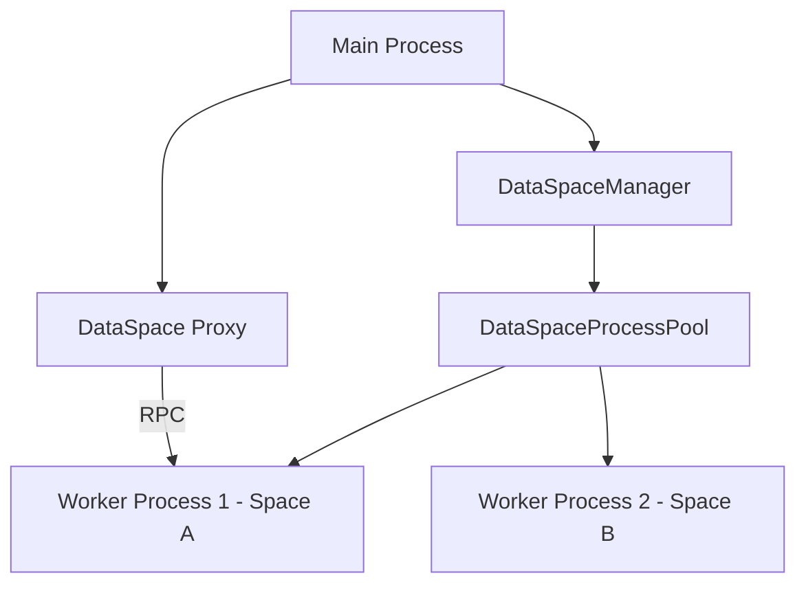

# DataSpace Implementation

This module manages the isolated execution environments for different workspaces (spaces) in Eidos.

## Overview

The `data-space` module has been refactored to use a **multi-process architecture**. Each workspace now runs in a dedicated Electron `utilityProcess`, providing better isolation, stability, and performance. Interactions with these processes are handled transparently through an RPC (Remote Procedure Call) layer.

## Architecture

### Key Components

1.  **`DataSpaceManager`**: A singleton in the main process that serves as the primary entry point. It manages the current active space and coordinates process spawning and proxy creation.
2.  **`DataSpaceProcessPool`**: Manages the lifecycle of worker processes (`utilityProcess`). It handles spawning, initialization (sending paths/credentials), and termination.
3.  **`DataSpaceProxy`**: A transparent wrapper using JavaScript `Proxy`. It allows calling methods on a `DataSpace` instance in the main process as if it were local, while automatically serializing and forwarding those calls to the appropriate worker process.
4.  **`Worker` (`worker.ts`)**: The entry point for the worker process. It initializes the actual `DataSpace` (with SQLite, Graft, and VFS) and executes RPC requests received from the main process.
5.  **`DataEventChannel`**: Handles event forwarding from the worker process back to the renderer process (via the main process).

## Features

- **Process Isolation**: Crashes or heavy operations in one space do not affect other spaces or the main process.
- **Transparent RPC**: Support for standard method calls and deep property access on the `DataSpace` interface.
- **External File System**: Support for virtual paths (`~/` for project root, `@/` for mounted folders) with Node.js-based file operations.
- **Async Iterator Support**: Specialized handling for functions that return `AsyncIterable` (e.g., file watching), allowing streamed results over IPC.
- **Dynamic Initialization**: Processes are spawned and initialized with specific configurations (SQL extensions, sync credentials, database paths) on demand.
- **Resource Management**: The process pool tracks active processes and handles cleanup on exit.

## Communication Protocol

Communication between the main process and workers uses Electron's `postMessage` with a structured `RpcRequest` and `RpcResponse` format:

- **`call`**: Execute a method on the `DataSpace` instance.
- **`execute-payload`**: A specialized call format used by the server-side logic.
- **`init`**: Sent once after process spawn to set up the environment.
- **`forward-to-renderer`**: Used by workers to send events that should be broadcast to the UI.

## File Structure

- `index.ts`: `DataSpaceManager` and public exports.
- `process-pool.ts`: Lifecycle management for `utilityProcess`.
- `rpc-client.ts`: Client-side RPC implementation and proxy creation.
- `rpc-server.ts`: Server-side RPC handler for worker processes.
- `worker.ts`: Worker process entry point.
- `rpc-types.ts`: TypeScript definitions for the communication protocol.
- `external-fs-node.ts`: Node-based implementation of the external file system.
