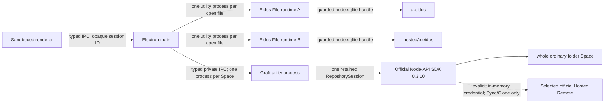

# Eidos Lite Desktop architecture slice

## Product boundary

- One window owns one canonical ordinary folder Space.
- A Space can contain multiple `.eidos` files and ordinary user-owned assets.
- One Space maps to one Graft repository and, when enabled, one official
  Hosted Remote. A single file is never treated as the Remote unit.
- Local use has no account requirement. Account, entitlement, Credits, and
  Remote provisioning enter only at Sync/Clone.
- Graft runs through the official `@eidos.space/graft` Node-API SDK. Lite does
  not implement the repository or HTTP Remote protocol. The verified CLI is a
  temporary comparison/fallback adapter, not the normal application path.

## Editor composition

The workbench owns only Space-level chrome: a path-first `@pierre/trees`
Explorer, the active-file titlebar, operation status, and version management.
The Explorer uses canonical Space-relative paths for focus and selection. It
is collapsible and adjustable from 208–480 px by pointer or keyboard; the last
expanded width is renderer-local presentation state. Lite deliberately has no
file-tab strip: exactly one `.eidos` is visible. Selecting another file makes
it active and moves it to the most-recent end of a three-entry in-memory LRU;
the oldest session is closed before a fourth file opens. The active file
surface composes the same public
`@eidos.space/eidos-file-ui` controls used by `apps/eidos-file-web`:

- `EidosFileEditorShell` for the stable workbar/content/sheet hierarchy;
- `EidosFileViewTabs` plus the Grid, Gallery, and Kanban built-in plugins;
- `EidosFileQueryToolbar` for Search, Filter, and Sort;
- `EidosFileViewFieldsPopover` and `EidosFileFieldCreatePopover`;
- `EidosFileSheetTabs` and `EidosFileSheetCreatePopover`.

CSV stays inside that canonical composition. The shared CSV import plugin owns
the Sheet-create preview, type inference, field overrides, and import dialog.
The selected browser `File` remains renderer-local; at most 16 MiB of owned
bytes crosses the opaque session call into that file's utility runtime, where
UTF-8 decoding, planning, and the atomic table mutation occur. View and Sheet
exports use the shared paged data-source helper, then send only the resulting
CSV bytes and a sanitized suggested name to main. Main owns the native save
dialog and never returns the chosen absolute path to the renderer.

Lite does not maintain a second table switcher or parallel field/view toolbar.
Host callbacks cross the existing opaque-session IPC boundary, and the utility
runtime remains the only process with a writable SQLite handle. Each open file
has independent table/view state; changing the active file never transfers a
runtime capability between sessions.

The Welcome route does not eagerly parse Space-only UI. The Pierre Explorer,
Sync panel, History panel, and canonical Eidos File workbench load at their
first visible use. The packaged performance gate still starts its file-open
clock before Explorer selection and waits for the shared Editor Shell and a
sized Grid canvas, so this boundary reduces launch work without excluding the
deferred editor cost from open/Grid evidence.

## Process and capability boundaries

The renderer never receives an absolute path, SQLite handle, SQL capability,
filesystem API, Graft token, or command execution capability. It receives the
display path for user orientation and opaque runtime session IDs. Electron
main canonicalizes the Space by real path plus filesystem identity, rejects
path escapes, does not traverse symlinked directories, and hides `.graft`
from the Explorer.

Each resident Eidos File owns an Electron utility process and one Electron 43
`node:sqlite` handle. Main independently caps resident utility processes at
three, so preload or test callers cannot bypass the process bound. Because
`node:sqlite` has no public interrupt API, request cancellation retains the
utility-process terminate profile. Evicted
metadata can transparently reopen its child; normal renderer use closes the
entire oldest session. A runtime crash rejects its in-flight requests and does
not invalidate the other cached files. Reopening the path creates a fresh
child.
The shared contract enumerates every allowed read and mutation method. The
renderer cannot invoke arbitrary object methods, SQL, filesystem paths, or
process capabilities. Main admits every mutation through
`SpaceOperationGate.withMutation`; schema and row validation remains inside
the Eidos File runtime.

Each Space can own one Graft utility process and one long-lived
`RepositorySession`, but neither is opened on the critical Space-window path.
The root Explorer and local Eidos File runtime become usable first; an idle
background status refresh or an explicit version/Sync action lazily creates the
utility and session. The native addon is loaded only in that utility process,
outside the sandboxed renderer. The SDK serializes commands for one retained
repository session; different Space windows have different workers and can
progress independently. Orderly Space shutdown cancels pending background
reads, drains repository work, awaits `RepositorySession.close()`, and only
then releases the worker. If the worker crashes, its repository lock is
released by the OS; the next operation spawns a fresh worker and opens the same
durable repository state.

The transport keys session ownership by the canonical Space root requested by
main. It must not compare that root with `RepositorySession.target`, because the
SDK exposes the repository metadata path (`Space/.graft`) there. Confusing the
two identities would reopen the native session before every command, discard
memory-only Remote credentials, and defeat both residency and serialization.

## Space operation gate

### Local-first performance contract

Local durability and cloud convergence are separate completion boundaries.
The renderer may acknowledge an interaction only after its allowed local
critical path completes:

| Interaction         | Awaited critical path                               | Explicitly deferred work                            |
| ------------------- | --------------------------------------------------- | --------------------------------------------------- |
| Open Space          | directory shell                                     | Graft open/status, account, Remote                  |
| Open Eidos File     | local runtime first frame                           | version status, History, Sync                       |
| Open/switch Table   | selected 100-row viewport                           | unrelated Tables and offscreen rows                 |
| Scroll/query        | visible row page + matching count                   | offscreen rows                                      |
| Edit row            | local SQLite mutation                               | checkpoint, diff, Sync                              |
| Edit field metadata | bounded distinct-value summary + metadata           | version status, Sync                                |
| Add physical field  | local SQLite schema migration                       | version status, Sync                                |
| Import CSV          | analyze, transactional import, final local snapshot | checkpoint, Sync                                    |
| Save version        | Graft stage + commit                                | post-commit status, account, queue I/O, fetch, push |
| Changes             | status/path/table summary                           | selected row diff                                   |
| History             | repository metadata + paged summaries               | selected checkpoint/path diff                       |

The executable budgets live in
`src/shared/performance-contract.ts`. Source tests, the synthetic performance
gate, real-Space probes, and packaged smoke must import or validate the same
contract. A feature is not performance-complete when only its underlying SDK
command is fast: evidence starts at the user action and ends at the first
usable UI state, with local completion and background convergence logged as
separate events.

The standard performance gate creates canonical 100,000-row and 1,000,000-row
Eidos Files. It measures first page, rapid Table switching, deep viewport
jumps, search, filter, sort, insert/update/delete, metadata-only field edits,
physical field add/drop, Text/Select conversion, and a streamed one-million-row
CSV from analysis through its final visible snapshot. Physical SQLite schema
migrations have a separate budget because `ALTER TABLE` can touch file pages;
they must never be mislabeled as metadata-only work or block the renderer.

One `SpaceRepositoryCoordinator` owns repository task priority for a Space.
Foreground reads may preempt cancellable background classification; background
work never cancels foreground work or another durable mutation. Renderer
components subscribe to generation/change-token projections and cannot create
their own repository session or place account/Remote work on a local critical
path.

Normal file reads can overlap. Repository operations are serialized per Space
by both `SpaceOperationGate` and the SDK session. SDK `status`, `diff`,
`history`, `fetch`, and `push` do not close application SQLite handles or pause
ordinary Eidos File mutations. Sync revalidates repository state before any
push or worktree materialization, so an edit made during network I/O stays
local and causes the stale Sync attempt to stop safely. A declared
worktree-materializing operation (`restore` or `pull`)
follows this state machine:

```mermaid
stateDiagram-v2
  [*] --> Ready
  Ready --> Quiescing: stop new mutations
  Quiescing --> Materializing: drain mutations; close every runtime
  Materializing --> Validating: Graft changes the worktree
  Validating --> Reopening: open every .eidos as a probe
  Reopening --> Ready: reopen prior resident LRU; clear journal
  Materializing --> Reopening: command error; resulting worktree validates
  Validating --> Failed: invalid materialization
  Reopening --> Failed: runtime reopen error
  Failed --> Validating: next-launch journal recovery
```

The operation journal lives under Electron `userData/spaces/<space-id>` rather
than in the Space. A crash after quiescing therefore leaves user files ordinary
and records enough phase information to validate all materialized `.eidos`
files before the Space becomes available at the next launch. The LRU is
process-local and is intentionally not restored across application launches;
during a live operation, only the pre-operation resident set is reopened.
If the materializing command fails but the resulting worktree validates and
all prior runtime handles reopen, the gate clears the journal, returns to
Ready, and surfaces the original command error without claiming Sync success.
Failed validation or reopen leaves the journal intact and local mutations
paused for next-launch or user-directed recovery.

The process-termination gate executes this production state machine in a child
process, kills it only after the `materializing` journal and a worktree change
exist, then constructs a fresh gate over the same owner state. Recovery must
close any new-process handles, validate a real Eidos File, reopen, clear the
journal, and enable a subsequent mutation without inferring a pull result.

Remote object transfer and ref publication remain wholly owned by the official
Graft SDK/HTTP Remote. Lite treats a rejected `push()` as unpublished even when
the SDK reports that object upload preceded the failure: it does not close
application SQLite handles, mutate the worktree, force a ref, or implement
protocol cleanup. The Local checkpoint stays authoritative and the background
queue may start only a new serialized push attempt with fresh memory-only
credentials.

Window binding canonicalizes a requested folder before constructing either the
Graft session or any SQLite runtime. The controller reserves that canonical
identity while the first session opens, so a concurrent path or symlink alias
focuses the existing window without creating a second repository session.
Closing a window registers its asynchronous `SpaceSession.close()` with a
controller-owned tracker. Application shutdown waits for both visible sessions
and already-closed windows that are still draining mutations or repository
work. Repeated close calls share the same in-flight promise.

Clone starts before a window owns a Space, so it uses a separate owner-only
`userData/clone-operations` journal. Main clones into an exact hidden sibling
of the requested destination, rejects an existing destination, and validates
every cloned `.eidos` through fresh native utility runtimes. Only a successful
validation permits one same-volume atomic rename to the user-selected ordinary
folder. A pre-publish failure removes only the coordinator-owned hidden
sibling. If the process exits after rename but before the external Sync marker
is committed, next-launch recovery validates the published folder and finishes
the marker; it never deletes the final folder.

## Space and file lifecycle

The welcome window exposes New Space, Open Space, Clone Synced Space, and Recent
Spaces. Creating a Space makes a normal user-owned folder. An empty Space
offers one prominent action that creates its first canonical `.eidos` through
the same guarded Explorer mutation path and opens it immediately; it does not
hide the new user behind an empty tree context menu. Opening records its canonical
filesystem identity in an owner-only `userData/recent-spaces.json`. The recent
list is written by temporary-file rename, deduplicates canonical Spaces, marks
missing folders unavailable, and removing an item never deletes the folder.

Explorer lifecycle operations use Space-relative paths only and run through
the same materialization gate as restore. New Eidos File creation happens in a
utility process and produces a canonical database with a starter table. New
folder, rename, move, copy, Trash delete, and import all close resident handles,
mutate ordinary files, validate every resulting `.eidos`, then reopen the
prior resident LRU. Rename and move invalidate sessions below the changed
path. Delete uses the operating-system Trash. Copy rejects symlinks, nested
`.graft` directories, and special files. Import accepts ordinary files only,
copies them to hidden unique temporary names, validates `.eidos` inputs before
publish, atomically renames them into place, and removes temporary or partially
published output on failure.

Watcher refresh compares every cached `.eidos` by canonical path plus device
and inode. External delete, rename, symlink replacement, or atomic file
replacement closes the stale session and tells the renderer to discard it.
During a gate-controlled materialization this check is paused; the reopening
phase refreshes identities for every cached path after validation. Therefore a
legitimate Graft restore preserves sessions whose paths still exist, while an
uncontrolled external replacement cannot inherit an old runtime capability.

The invalidation crosses IPC as a typed, Local-safe file issue rather than a
native SQLite or filesystem error. Missing, replaced, symlink, unsupported,
unreadable, locked, corrupt, and unknown-open failures have separate recovery
copy and capabilities. Lite never recreates, repairs, follows, or overwrites the
path automatically. The editor offers only actions valid for that state:
explicit retry, reveal in the operating system, or review whole-Space History.
An explicit successful reopen refreshes filesystem identity, clears the issue,
and creates a fresh opaque runtime session.

Local versioning is explicit and account-free. **Enable Versioning** initializes
one repository for the ordinary folder, stages the whole Space, and creates an
initial checkpoint. **Create Checkpoint** appears only when that repository is
dirty and stages and commits all Space changes through a consistent online
SQLite snapshot without closing editor runtimes. It returns the new durable
HEAD immediately; post-commit classification and any connected Sync queue work
are background operations. Neither action provisions a Remote, authenticates
an account, or claims cloud Sync.

After versioning is enabled, the Space watcher also feeds a stable-change
checkpoint scheduler. It coalesces edits for 30 seconds and bounds continuous
editing at five minutes. Automatic checkpoints use the same mutation drain,
bounded `stagePaths()`, and whole-Space commit contract as manual checkpoints.
They do not close SQLite handles or run worktree validation because staging and
commit do not materialize user files. Window close performs a best-effort
flush. When Eidos Sync is connected, the existing background queue coalesces
the resulting checkpoint into one serialized whole-Space Sync run; Local-only
Spaces remain account-free.

The user-facing version vocabulary is **Changes**, **History**, **checkpoint**,
and **Restore**. The renderer receives a typed, sanitized projection of
official SDK data, but the list surfaces never hydrate an unbounded repository:

- Space snapshots use `statusIncremental()` and retain its generation/change
  token for cache invalidation. A verified, content-addressed classification
  snapshot under `.graft/cache/sdk-status` lets a replacement utility process
  reuse path metadata; a fingerprint mismatch falls back to a complete rebuild.
- Changes lists use only `status.paths`; History reads head/branch through the
  zero-scan `repositoryMetadata()` API before paginated `historySummaries()`.
- Remote inspection uses the credential-free, zero-scan `listRemotes()` API;
  bearer credentials never appear in its projection.
- Opening one checkpoint pages `commitChangedPaths()` without reading blobs.
- Selecting one file requests only that path through historical or working
  `diffPaths({ paths, rows: true })`.

This can show ordinary path changes and logical Eidos table row changes without
passing a Graft executable, repository path, or command surface to renderer.
All reads are cancellable; cancelling a panel read leaves the retained session
available for the next operation. If a concurrent filesystem/ref writer
exhausts the SDK's internal stability checks, Lite retries the retryable
`GRAFT_SDK_REPOSITORY_STALE` status result once without retrying mutations.

A new large repository can require a cold session open and status
classification even though subsequent resident status calls are cached.
Initial window hydration therefore reads only the Space root directory and
returns it with an explicit `checking` version state. Graft session creation is
scheduled after the local shell is usable. Opening an Eidos File or expanding a
directory cancels that low-priority read, completes the local interaction, and
reschedules status. The authoritative status is emitted when ready; a status
failure remains visible but does not invalidate the Explorer or Eidos File
runtime. Mutating version and Sync actions never use the placeholder and still
wait for a real repository read.

Explorer directories load only when expanded and cache direct children by
canonical relative path. Each directory request submits at most 1,000 entries
per SDK batch-ignore query. The watcher coalesces filesystem events, invalidates
only affected parent/prefix caches, and reloads only parents that were already
visible. Sync preflight still scans the complete Space in breadth-first waves,
with bounded batch ignore queries, because its approval contract requires exact
whole-Space counts. Ignored untracked directories are pruned before descent.
Ignored paths that are already tracked stay visible and synchronized until the
user explicitly reviews the paginated `tracked_ignored` inventory and confirms
an index-only `untrackPaths()` migration. Ignore rules never silently rewrite
history or delete local files.

Sync preflight computes its manifest and risk totals over the complete visible
Space, but returns only a bounded review sample plus exact excluded, warning,
and blocker counts. This keeps renderer IPC and React state bounded without
weakening approval or blocker decisions.

Whole-Space restore is forward-only:

1. Main rejects a dirty worktree and an `expectedHead` that no longer matches.
2. Graft pages `commitChangedPaths()` from the selected checkpoint through the
   current first-parent history to enumerate changed Space paths.
3. `SpaceOperationGate` drains mutations and closes all Eidos File handles.
4. Official SDK `restorePaths({ source, expectedHead, paths })` materializes
   bounded batches, including additions and deletions.
5. The gate opens every resulting `.eidos` with a native validation probe.
6. Only after validation does main stage the whole Space and create a new
   `Restore checkpoint …` child commit, then reopen prior runtime sessions.

This does not reset a ref or rewrite history. A restore can itself be restored.
If a path restore or post-validation commit fails, the gate validates and
reopens the recoverable worktree, preserves the journal, reports the failure,
and never claims that a restore checkpoint was created.

## Graft boundary

`GraftClient` remains the product-facing structured boundary and requires an
SDK session transport at construction. Status, diff, history, checkpoint,
restore, push, and clone never create a CLI subprocess; Lite has no backend
switch, executable lookup, or CLI credential environment path.

The SDK adapter pins published `@eidos.space/graft@0.3.10`,
lazily opens one session on the first background or explicit repository read,
and closes it when the window closes. It asks the published
`operationMaterializesWorktree()` contract before restore. Remote credentials
are set on the retained session with the SDK's explicit
`setHttpBearerToken()`/`configureRemote({ bearerToken })` memory path, cleared
on sign-out, and dropped with the session. They are never stored in repository
config, embedded in a URL, written to a journal, logged, or inherited through
`GRAFT_REMOTE_TOKEN`.

The integration contract performs a real local HTTP request through
`GraftClient`, rotates the explicit push token, and requires every request to
carry it. Checking only that `config.toml` omits the token is insufficient: it
does not prove that the retained adapter session survived between credential
injection and push.

Product code accepts only HTTPS repository URLs beneath the selected
environment's exact official Remote origin. A staging process rejects
production URLs and a production process rejects staging URLs. The `fs://`
Remote is limited to the repeatable local SDK integration test.

The local gate uses the resident SDK to commit a Space containing two real
Eidos Files plus an ordinary asset, push the whole repository, clone it to an
isolated folder, check all files materialized, and open both SQLite files with
the native runtime. It also verifies declared materialization and close/reopen
lifecycle.

## Service environments and control-plane separation

The main process resolves one immutable `staging` or `production` preset. No
renderer input, Space file, repository config, or arbitrary URL can change an
origin. Development, normal builds, and unsigned packages compile with staging
as the default; the explicit production build compiles with production as the
default. Development can select the other approved preset with
`EIDOS_LITE_ENVIRONMENT`, and any other value fails before a window opens.
Packaged applications ignore the inherited override and use only their compiled
preset. The main build emits a service-environment manifest from the same typed
value as the compiler define; both build and packaging commands reject a stale
or mismatched manifest before electron-builder runs.

| Environment | Account / OAuth               | Billing / entitlement / Credits | Hosted Remote                      |
| ----------- | ----------------------------- | ------------------------------- | ---------------------------------- |
| staging     | `https://staging.eidos.space` | `https://staging.eidos.space`   | `https://sync-staging.eidos.space` |
| production  | `https://eidos.space`         | `https://eidos.space`           | `https://sync.eidos.space`         |

Account and Billing currently share an origin but remain separate typed
responsibilities. The non-secret environment projection crosses the preload
boundary for UI labeling; tokens never do. Opening and editing a Local Space
does not contact any service. Discovery, authentication, entitlement checks,
repository provisioning, and Graft data transfer remain explicit Sync/Clone
actions.

## Account and Sync activation boundary

**Enable Eidos Sync** and **Clone Synced Space** share one control plane but do
not alter Local mode. The current activation flow is deliberately split:

1. Renderer asks main for a sanitized status projection. No token crosses IPC.
2. On explicit sign-in, main discovers the selected environment's OIDC
   endpoints, creates an authorization-code request with PKCE S256 and random
   state, then opens the system browser.
3. A loopback listener accepts only `127.0.0.1:13128/oauth/callback`, verifies
   state, exchanges the code, and reads UserInfo. Authorization codes and tokens
   are never placed in application URLs or logs.
4. The session is stored under
   `userData/accounts/<environment>/oauth-session.bin` through Electron
   `safeStorage`. If OS encryption is unavailable, Lite fails closed instead of
   writing plaintext. Staging and production sessions cannot be reused across
   environments.
5. Before persisting a new or refreshed session, main registers one stable
   UUID v4 installation identity with the account service. The UUID is stored
   owner-only outside both the Space and rotating encrypted OAuth credentials.
6. Main reads `/api/sync/userinfo` and accepts only the versioned,
   billing-owned `sync_access` grant. Missing, malformed, or `blocked` grants
   cannot access a Hosted Remote. `read_only` may list, clone, and pull an
   existing repository but cannot provision or push.
7. Before Remote provisioning, main builds a whole-Space manifest from local
   filesystem metadata. The renderer receives file count, `.eidos` count, total
   bytes, actual exclusions, and risk paths, but no file contents. `.graft`, OS
   noise, and SQLite sidecars are excluded. Hidden and secret-like paths plus
   files at least 100 MiB require an unchecked explicit confirmation. Symlinks,
   unsupported filesystem entries, and files over 1 GiB block activation.
8. The approval carries a SHA-256 manifest identity. Main recomputes and checks
   it before provisioning, then checks it again before configuring Graft or
   pushing. A concurrent local change invalidates the approval and returns the
   user to scope review instead of silently widening the upload.
9. With `read_write`, main provisions one deterministic repository for the
   Space through the Hosted Remote control plane. It then closes `.eidos`
   handles, configures the exact official Remote with Graft, pushes the whole
   clean Space, validates every materialized database, and reopens the handles.
10. Only after that first push and validation does main atomically persist an
    owner-only Sync marker under `userData/spaces/<space-id>`. The marker and
    configured Graft origin must agree before the renderer sees `connected`.

**Clone Synced Space** lists only repositories returned for the current
device-bound account. Selecting one keeps the bearer token in main, asks for a
new local folder name, and runs the journaled hidden-sibling clone described
above. The renderer receives repository display metadata and the resulting
Space snapshot, never the token or an arbitrary Remote capability.

For an already connected Space, **Sync Now** runs one explicit reconciliation:

1. Re-authorize the exact stored Remote against the signed-in account's current
   repository list and put the fresh bearer token in the retained SDK session.
2. Require a clean local worktree, then fetch with application SQLite handles
   still open.
3. Classify history from the structured `local`, `remote_target`, and
   `common_ancestor` identities. Counts remain display metadata and a legacy
   fallback; they do not override contradictory graph identities. A true
   divergence is reported before changing any user file.
4. If only Hosted history is ahead, re-check the clean/divergence precondition,
   stop new mutations and drain active ones. If the Space changed after fetch,
   clear the not-yet-materialized journal and return to Ready without closing
   handles. Otherwise close all `.eidos` handles, pull, validate the entire
   Space, and reopen the previous resident LRU.
5. If only Local history is ahead, push only with `read_write`; `read_only`
   reports the unpushed local checkpoints without discarding them.

### Multi-device collaboration state machine

Sync state belongs to each local clone, not to the account or to a renderer
window. Hosted exposes one authoritative branch head, updated with
compare-and-swap publication. A device learns that another device moved that
head only after a successful fetch; Lite never broadcasts or copies another
device's in-memory Sync or merge UI state.

After every fetch, Lite classifies the clone from the structured commit
identities rather than from timestamps or checkpoint counts:

| Relation     | Structured condition                                                        | Safe next action                                      |
| ------------ | --------------------------------------------------------------------------- | ----------------------------------------------------- |
| `up_to_date` | `localHead === hostedHead`                                                  | No materialization                                    |
| `behind`     | `commonAncestor === localHead` and Hosted differs                           | Guarded fast-forward pull                             |
| `ahead`      | `commonAncestor === hostedHead` and Local differs                           | CAS push with `read_write`; report only for read-only |
| `diverged`   | the common ancestor differs from both heads                                 | Reviewed merge or two-copy recovery                   |
| `blocked`    | no valid common ancestor, invalid contract, dirty worktree, or auth failure | Preserve Local and surface the precise recovery       |

An open Space first restores durable merge state. An active merge pauses the
ordinary background reconciliation queue; it is resumed only after continue
or abort returns the repository to a non-merging state.

```mermaid
stateDiagram-v2
    [*] --> Restoring
    Restoring --> Resolving: getMergeStatus = merging
    Restoring --> NeedsComparison: getMergeStatus = none

    NeedsComparison --> Comparing: authorized fetch
    Comparing --> UpToDate: Local = Hosted
    Comparing --> Behind: ancestor = Local
    Comparing --> Ahead: ancestor = Hosted
    Comparing --> Diverged: ancestor differs from both
    Comparing --> Blocked: invalid graph, dirty, auth, or protocol failure

    Behind --> Pulling: gate acquired and clean rechecked
    Pulling --> NeedsComparison: pull, validate all .eidos, reopen
    Ahead --> Pushing: read_write and Remote CAS
    Pushing --> UpToDate: publication wins
    Pushing --> NeedsComparison: Remote CAS loses; fetch again

    Diverged --> Planning: explicit Start merge
    Planning --> Resolving: expectedHead + planToken accepted
    Planning --> NeedsComparison: plan is stale or relation changed
    Resolving --> Resolving: cell, row, table, path, or text choice
    Resolving --> Resolving: reopen app or reload latest stateToken
    Resolving --> ReadyToContinue: unmergedCount = 0
    ReadyToContinue --> Resolving: unresolve a path
    ReadyToContinue --> NeedsComparison: continue creates local two-parent commit
    Resolving --> NeedsComparison: explicit abort restores ORIG_HEAD
```

Every successful merge mutation produces a new local `stateToken`; a stale
operation is rejected without replay. Closing the window leaves `Resolving` or
`ReadyToContinue` durable. Reopening calls `getMergeStatus` and reconstructs
paths, tables, rows, and current choices from Graft rather than renderer state.
Path-level unresolve is the Git-style escape from a staged/resolved path and
must reconstruct its conflict stages through Graft; Lite never synthesizes
those stages from displayed data.

The important cross-device transitions are:

1. Device A may resolve a divergence and create a two-parent merge locally.
   Until A publishes it, Hosted and every other device are unchanged.
2. A fresh reconciliation fetches before A pushes. The push uses the fetched
   Hosted head as a CAS boundary; if another device published first, A returns
   to `NeedsComparison` and reclassifies instead of force pushing.
3. After A publishes merge commit `M`, a device B whose Local head is either
   parent or any other ancestor of `M` classifies as `behind`. B can pull `M`
   directly through the guarded fast-forward path; it does not open the merge
   workspace again.
4. If B created a new checkpoint not contained in `M`, B classifies as
   `diverged` after fetch and must run another reviewed merge. A prior merge on
   A is not permission to discard B's new Local history.
5. If Hosted moves while B already has an active merge, B's local
   `stateToken` still guards only that durable local merge. B may finish or
   abort it, but publication always performs a fresh fetch; a changed Hosted
   head can therefore produce another divergence before push.

No implicit merge, reset, force push, or automatic winner selection exists.
When the structured relation is `diverged`, the conflict workspace drives a
reviewed, restart-safe merge:

The living
[merge schema compatibility matrix](./MERGE-SCHEMA-COMPATIBILITY.md) assigns
stable scenario IDs to physical SQLite classification, Eidos-domain
validation, Lite UI behavior, and executable coverage. A missing Graft schema
conflict is never by itself proof that an Eidos candidate is safe.

1. Main re-authorizes and fetches, confirms a clean worktree and the same
   divergent graph, derives a data-only Policy v1 from every open-format Eidos
   File, then calls `planMerge(origin/main)` with `expectedHead`. Eidos File
   1.0 explicitly enables `same_row_merge`, uses `_id` as the default semantic
   key, and marks only `_updated_at`/metadata `updated_at` as
   `max_timestamp`. Revision counters and other domain values are not guessed.
   The renderer receives only the projected Base/Local/Hosted identities,
   conflict paths, opaque `planToken`, and the policy token/version.
2. Policy validation and update use `expectedPolicyToken` CAS. The plan token
   is bound to the policy, and Graft freezes the actual policy for an active
   merge. Apply requires both `expectedHead` and `planToken`. Graft persists
   `ORIG_HEAD`, `MERGE_HEAD`, and index stages. `getMergeStatus` reconstructs
   the workflow and its frozen policy when the Space or application is
   reopened.
3. Every subsequent read or mutation supplies the latest `stateToken`. A stale
   CAS response is mapped to a typed renderer-safe failure; the workspace
   reloads durable state and does not replay the rejected choice.
4. `applyMerge`, whole-path choice, SQLite row/cell/table choice, path
   unresolve, edited text staging, continue, and abort all use the existing
   `SpaceOperationGate`. It journals, stops new mutations, drains active writes,
   closes resident Runtime/SQLite handles, materializes, validates every
   `.eidos` in the Space, and restores the previous resident Runtime set.
   Cancel, exception, window close, and startup recovery use the same cleanup
   boundary.
5. Text shows Base/Local/Hosted plus an editable result. Binary paths allow
   Local or Hosted; "keep both" aborts to the non-destructive two-Recovery-Space
   flow. `.eidos` paths list table conflicts, use Graft's stable row identity,
   and allow cell, row, safe-table, or complete-file scope. Graft's
   `conflict.columns` is the conflicting subset while row payloads are full
   physical rows, so SpaceSession enriches user-table conflicts with the Eidos
   Runtime's exact physical column order before rendering. Resolved conflicts
   remain inspectable after reopen; unresolve restores the original staged
   conflict candidate. Eidos Runtime still owns semantic validation; Graft is
   not asked to understand Eidos domain rules.
6. A future application-owned `recompute` writes the candidate through Eidos
   Runtime, validates all `.eidos` files with handles closed, and only then
   calls non-materializing `stageMergeSqliteResult`; Graft performs SQLite
   integrity/foreign-key checks and captures the exact bytes. No Graft policy
   resolver executes Eidos business code.
   A Graft `automatic_merge_available` result is not equivalent to that staged
   candidate. Until Graft exposes a successful, state-token-guarded operation
   that materializes the analyzed candidate without committing it, Lite keeps
   the path unresolved and offers only complete-file Local/Hosted recovery. It
   does not stage the current Local worktree or depend on a failed `continue`
   side effect.
7. Continue is enabled only after Graft reports zero unmerged paths. Main runs
   a full Eidos validation while handles are closed, passes that exact token to
   `continueMerge`, and queues the resulting two-parent checkpoint for Sync.
   Abort restores the pre-merge Local head and retains Hosted history.

The merge surface is compiled against a type-only snapshot kept aligned with
the published Graft 0.3.10 declaration. `EIDOS_LITE_GRAFT_SDK_PATH` may select
a compatible local package in source development and tests; production always
resolves the pinned SDK and fails closed with a typed unavailable result if its
runtime contract is incomplete.

Repository status also projects `path_diagnostics`. A skipped, corrupt, or
analysis-failed path blocks merge planning with its path, protection state,
and recovery message. `protected_by_index` is evidence about whether the
current bytes are captured; it is never interpreted as permission to discard
the worktree copy.

Main emits a typed, per-run Sync timeline as each boundary is crossed:
authorization, fetch, relation analysis, mutation drain/handle close, pull,
full-Space validation, handle reopen, and push. The renderer receives only the
run ID, phase label, monotonic elapsed projection, and final phase durations.
It never receives credentials or a Graft command surface. Skipped phases are
omitted, so a clean no-op or conflict result accurately stops after analysis
instead of fabricating pull/push work.

Expected failures do not use Electron's lossy thrown-error channel. The
`runSync` contract resolves to either a successful `EidosSyncRunResult` or a
typed failure containing the run ID, authoritative failed-phase telemetry, and
one sanitized `EidosSyncFailure`. Classification stays in main: it consumes
account/Remote error codes and HTTP status, SDK lifecycle codes, and the SDK's
redacted repository-command diagnostic. Renderer never parses a Graft/HTTP
message and never receives that technical diagnostic.

| Product state        | Representative conditions                         | Primary action         |
| -------------------- | ------------------------------------------------- | ---------------------- |
| Offline              | timeout, DNS, connection reset                    | Retry now              |
| Paused: sign in      | 401, expired session, revoked device binding      | Sign in again          |
| Sync access required | missing, blocked, or inactive Sync grant          | Manage Sync access     |
| Paused: storage full | HTTP 413 or explicit quota rejection              | Manage storage         |
| Needs attention      | protocol mismatch, missing Remote, local changes  | Update/re-clone/review |
| Service unavailable  | rate limit, 5xx, persistence failure, worker exit | Retry/work locally     |

Every failure projection has `localSafe: true`; a Remote failure never rolls
back an already committed SQLite transaction. HTTP 409 during reconciliation
maps to a retryable Remote race, while an analyzed ahead+behind relation remains
the ordinary non-error `conflict` outcome and keeps its two-copy recovery UI.

Connected Spaces also use one main-owned background queue. A successful Local
checkpoint coalesces all current Space checkpoints into one pending item;
Local-only Spaces never attach an account or create an item. Manual **Sync
Now** promotes the same item to immediate execution rather than opening a
second repository path. Every attempt enters the same `SyncExecutor`,
`SpaceOperationGate`, and retained SDK `RepositorySession`, so a Space has at
most one reconciliation while different open Spaces can progress
independently.

The queue persists only sanitized scheduling state at
`userData/spaces/<space-id>/sync-queue.json`: state, trigger, attempt count,
timestamps, and the already-safe failure projection. It never stores a bearer
token, Remote credential, repository configuration, or renderer capability.
Each attempt obtains fresh account authorization in memory. A process exit
while an item is `running` reopens it as `pending` with a `crash-recovery`
trigger when that Space next binds.

Retryable failures use five total attempts: 1 s, 2 s, 4 s, 8 s, then the item
pauses after the fifth failed run; the exponential delay is capped at 60 s for
future larger budgets. A valid service `Retry-After` is a floor, bounded to 15
minutes to reject hostile values. Non-retryable account, entitlement, quota,
protocol, repository, local-change, and unknown states pause immediately.
Manual Retry resets the attempt budget and cancels an existing wait. Queue
state crosses typed IPC for status only, and the titlebar/panel surface
`pending`, `running`, `retry-wait`, or `paused` without hiding Local editing.
An entitlement loss reported after authorization still pauses this same item;
restoring the subscription does not fabricate completion or create a second
job. Explicit Retry obtains fresh memory-only authorization and removes the
stored item only after the whole current repository reconciles successfully.
Quota exhaustion follows the same non-automatic pause boundary: elapsed time
alone cannot trigger another write. Capacity restoration requires explicit
Retry and preserves the same current-repository reconciliation semantics.

An ahead+behind result shows the exact Local-only and Hosted-only checkpoint
counts and states that recovery neither merges nor overwrites the current
Space. It exposes exactly two non-destructive recovery actions:

1. **Copy Local history** rechecks the fresh Remote relation and
   requires a clean local checkpoint. `SpaceOperationGate` drains mutations and
   closes SQLite handles while the clone coordinator copies ordinary user
   files into a journaled hidden sibling. Root `.graft` metadata is excluded,
   non-portable inputs are rejected, every `.eidos` is validated, and the copy
   is atomically published as a disconnected Space in a new window.
2. **Clone Hosted history** rechecks account ownership and divergence,
   then uses the existing memory-credential cold-clone path. It validates and
   atomically publishes a separately connected Space in a new window.

The original divergent Space is never materialized by either action. Both use
owner-only operation journals and refuse an existing destination. A canceled
save dialog changes nothing.

Binary paths use the same explicit Keep-both model. Lite performs no file-level
merge: the Local Recovery copy retains the Local bytes without `.graft` or a
Sync marker, while the Hosted Recovery clone retains the Hosted bytes and its
verified external marker. The original divergent binary remains untouched.

Lite uses the OAuth client identity `lite.desktop.eidos.space`. The
account-service source owns a single registry for both the Better Auth
trusted-client configuration and the
consent screen, with Lite fixed to the exact 13128 loopback redirect. The same
registry is the allowlist for device-token binding. Deploying and exercising
that source through the disposable staging OAuth acceptance verifies the real
PKCE, consent, token, refresh, device and grant path; a discovery document or
initial login redirect alone is still never treated as completed login.

`OfficialSyncClient` owns only the official Remote management surface. It
validates discovery, repository list/provision responses, repository names, and
every returned Remote URL against the selected preset. It separately maps
401/403/404/409/413/426/429 and 500/502/503/504; the main classifier then
projects those codes into product states. It is invoked only after a fresh
device-bound authorization grants write access; Local open/edit and the
signed-out UI never call it.

The Sync slice preserves three independently testable responsibilities:

1. The selected account origin owns OAuth and device sessions.
2. The selected Billing origin owns entitlement and Credits decisions.
3. The selected Sync Remote origin owns repository provisioning, quota
   enforcement, and Graft data transfer.

The current official Remote accepts the rotating OAuth access token as a bearer
and validates its device binding plus narrow grant through the account identity
service on every request. The token remains in main, reaches Graft only through
the retained SDK session's explicit in-memory credential API, is never embedded
in a URL, Space, repository config, journal, log, or process environment, and
is re-bound after refresh; it is not treated as a permanent credential.
Billing remains out of the data plane and publishes only the versioned
access/quota decision.
Public Remote discovery is integrated and verifies Graft Remote v1, its URL
template, and matching authentication authority in both environments. Public
OIDC discovery also verifies issuer, authorization/token/UserInfo/JWKS
endpoints, authorization-code and refresh grants, PKCE S256, and required
scopes. The authenticated device/grant and repository-management contracts are
covered by local contract tests, and the existing staging account/Remote smoke
passes. The deployed Lite OAuth flow and disposable real-Graft staging
push/clone also pass, including native clone validation and device revocation.
Production remains a separate release gate, and discovery success is never
reported as Sync success.
