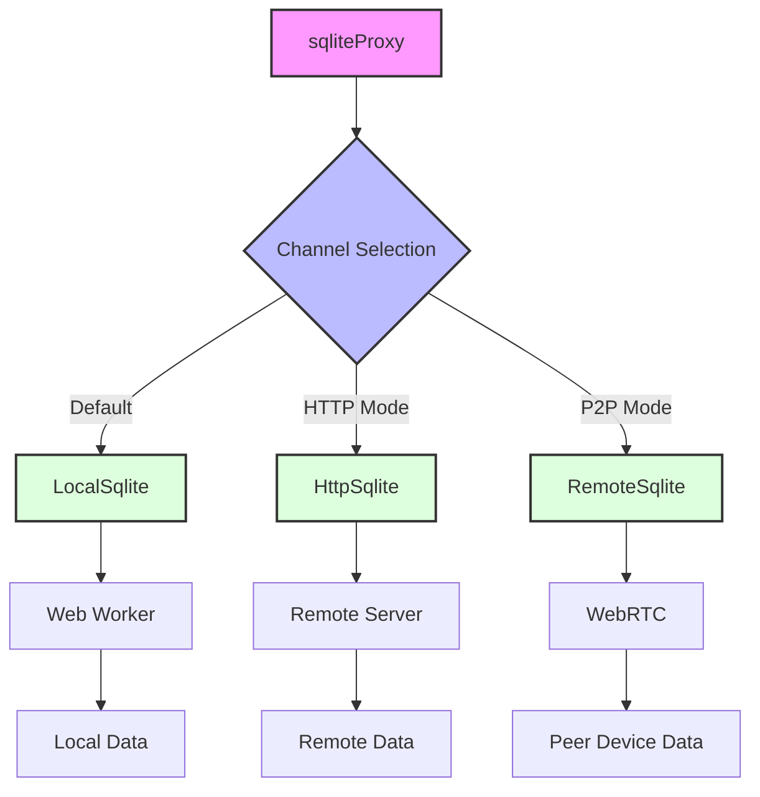

# sqliteProxy

sqliteProxy provides an abstraction that allows reading from different data sources by switching between various channels. By default, it reads data from a local web worker, but it can also read data remotely via HTTP or in a P2P mode using WebRTC.

## Architecture

The following diagram illustrates the architecture of sqliteProxy:

## Channels

1. **LocalSqlite**: Default channel that uses a Web Worker for local data processing.
2. **HttpSqlite**: Used in HTTP mode to fetch data from a remote server.
3. **RemoteSqlite**: Used in P2P mode for WebRTC-based data exchange between peer devices.

Each channel implements the `ISqlite` interface, ensuring consistent functionality across different data sources.
